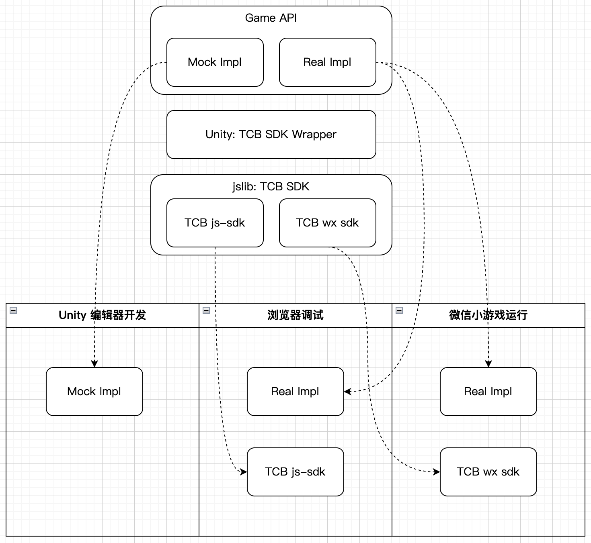

# Unity + 腾讯云开发 = 微信小游戏

> 建议先阅读【 [How Can Unity+腾讯云开发=微信小游戏](https://mp.weixin.qq.com/s/RTmWhx7BUytSA3fCWfBb3g) 】和 【[云开发让 Unity 微信小游戏实时聊起来](https://mp.weixin.qq.com/s/FxLga4VcV0Uxnhoy3MWxLw)】两篇文章了解下设计思路和实现细节

## 如何使用

0. 新建云函数 getUserUUID（非必须）

   > 什么场景需要？  
   > 使用云开发在微信小游戏中会静默登录，但在云开发中并没有对应的用户实体。所以可以通过该云函数获取登录用户的 UUID，开发者可根据该用户 UUID 去关联自己的用户体系。  
   > 接下来就可以使用 `TCBSDK.Instance.GetUserUUID()` 来获取到用户的 UUID 了

   a. 在云开发云后台新建 getUserUUID 云函数

   b. 下载到本地并安装依赖

   ```sh
   $ tcb fn code download getUserUUID -e <你的云开发环境ID>
   $ cd functions/getUserUUID/
   $ npm init --yes
   $ npm install --save wx-server-sdk@latest
   ```

   c. 修改代码为以下

   ```js
   const cloud = require("wx-server-sdk");
   const crypto = require("crypto");
   cloud.init({
     env: cloud.DYNAMIC_CURRENT_ENV,
   });

   exports.main = async (event, context) => {
     const { OPENID } = cloud.getWXContext();
     return {
       uuid: crypto.createHash("md5").update(OPENID).digest("hex"),
     };
   };
   ```

   d. 上传代码

   ```sh
   $ tcb fn code update getUserUUID -e <你的云开发环境ID>
   ```

1. 在你的 Unity 工程中使用 `Assets/Plugins/tcbsdk.jslib` 和 `Assets/Scripts/TCBSDK.cs`

   - 方式一：Export 为 .unitypackage 压缩文件（只需选择这两个文件进行导出即可），然后在你的 Unity 工程中进行 Import

   - 方式二：直接将两个文件复制到你的 Unity 工程

2. CloudBase SDK 的初始化和调用代码示例

```c#
using TencentCloud.CloudBase;

public class MainController : MonoBehaviour
{

    IApp app;

    async void Start()
    {

        // 1. 初始化云开发

        app = await TCBSDK.Instance.Init(new CloudInitParams() { env = "你的云开发环境 ID" });

#if !WEIXINMINIGAME
        await TCBSDK.Instance.Auth_SignInAnonymously();
#endif
        // 2. 调用云开发

        // 数据模型获取单条数据示例。有两种方式
        var options = {...}
        await TCBSDK.Instance.ModelsGet<ModelHello>(new ModelsReqParams() { modelName = "hello", options = options });
        await app.Models.Get<ModelHello>(new ModelsReqParams() { modelName = "hello", options = options });

        // 调用云函数示例
        var data = {...}
        await TCBSDK.Instance.CallFunction<HelloFnResult>(new CallFunctionParams() { name = "helloFn", data = data });

        // 调用云数据库示例
        var database = app.Database();
        var whereGetRes = await database.Collection("hello").Where(new Dictionary<string, object>
        {
            // 查询条件
        })
        .Get<ModelHello[]>();
        var watchObj = database.Collection("hello").Where(new Dictionary<string, object>
        {
            // 查询条件
        })
        .Watch(new WatchParams<ModelHello>()
        {
            OnChange = (WatchChangeData<ModelHello> data) =>
            {
                if (data.type != "init")
                {
                    Debug.Log($"watch change: {JsonConvert.SerializeObject(data.docChanges)}");
                }
            },
            OnError = (string err) =>
            {
                Debug.Log($"watch err: {err}");
            }
        });
    }

}
```

## 推荐开发流程



1. Unity 编辑器开发阶段

   使用 Mock 数据开发，节省构建成 WebGL 的时间，同时可确定业务逻辑所使用接口的输入和输出数据结构

2. 浏览器预览调试阶段

   根据确定的业务逻辑接口，通过 TCBSDK 开发调用云开发服务的代码，构建成 WebGL，预览实际的效果

3. 转换成微信小游戏阶段

   最后转换成微信小游戏，进行最终效果预览

## 如何转换成微信小游戏

1. 增加 `WEIXINMINIGAME` 预处理符号

   Build Settings > WebGL > Player Settings > Scripting Define Symbols 中添加 WEIXINMINIGAME

2. 通过微信小游戏转换工具进行转换

   具体参考 [转换工具导出微信小游戏](https://wechat-miniprogram.github.io/minigame-unity-webgl-transform/Design/Transform.html)
